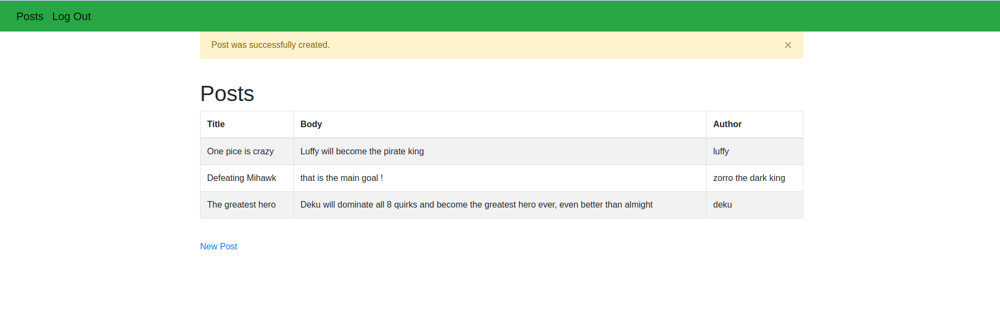

# Authentication

> The project is based on Authentication, meaning if a user is logged in
> will have the ability to create a new post, if the user is not logged in
> he won't be able to

Additional description about the project and its features.

## Built With

- Ruby
- Rails
- Bootstrap
- PostgreSQL

### Prerequisites

- Ruby 2.7.0
- Rails gem
- Bundle

### Setup

- Open your terminal and go to the directory where you want to clone the repo.

- Clone the repository to your local machine.

`git clone git@github.com:cvilla714/authentication.git`

- Go to the Authenticatio directory.

- `cd authentication`

- Install the necessary gems to run the project.

- run `bundle install`
  > Also please run this command to run all the migration for the database and have all tables updated and read to use
- run `rails db:migrate`
  > Now your environment is ready to run the project. Type:
  > run `rails server`

## Authors

👤 **Elbert Corniel**

- GitHub: [@elberthcorniell](https://github.com/elberthcorniell)
- Twitter: [@elberthcorniell](https://twitter.com/elberthcorniell)
- LinkedIn: [Elbert Corniell](https://www.linkedin.com/in/elbert-corniell-989183159/)

👤 **Cosmel Villalobos**

- Github: [@cvilla714](https://github.com/cvilla714)
- Twitter: [@kckeyti](https://twitter.com/kckeyti)
- LinkedIn: [Cosmel Villalobos](https://www.linkedin.com/in/cosvilla/)

## 🤝 Contributing

Contributions, issues, and feature requests are welcome!

Feel free to check the [issues page](issues/).

## Show your support

Give a ⭐️ if you like this project!

## Acknowledgments

- The Odin Project
- Microverse
- Rails Guides

## 📝 License

This project is [MIT](lic.url) licensed.
